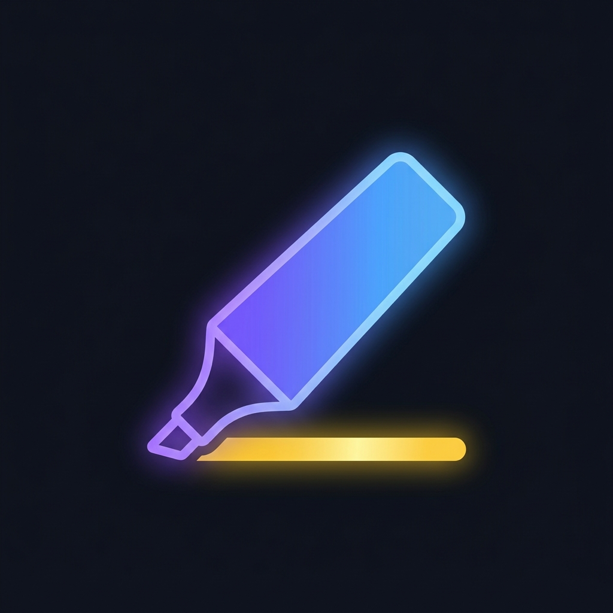
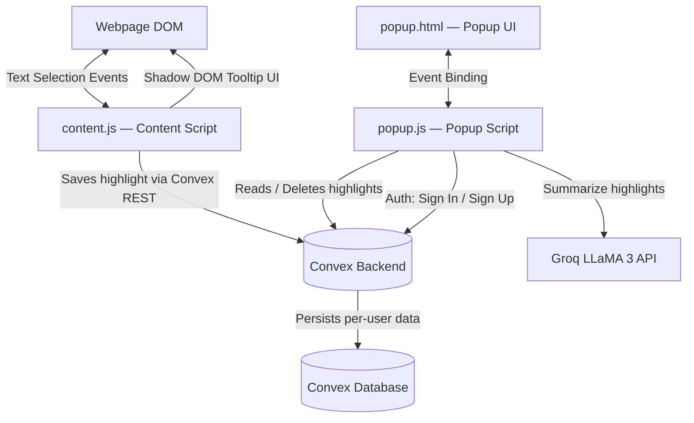

<p align="center">
  
</p>

<h1 align="center">Website Highlight Saver</h1>

<p align="center">
  <strong>A Chrome Extension to save, search, and AI-summarize text highlights from any webpage.</strong>
</p>

<p align="center">
  
  
  
  
  
</p>

---

## ✨ Features

| Feature | Description |
|---|---|
| 🖱️ **In-Page Tooltip** | Select any text — a floating tooltip appears with three actions: **Save Highlight**, **AI Summary**, and **Summarize Page** |
| 📄 **Full Webpage Summarization** | Click "Summarize Page" to extract webpage content and generate structured sections: **Overview**, **Agenda & Main Topics**, and **Key Takeaways** |
| ☀️ **Light / Dark Theme** | Modern Light Mode by default with a live theme switcher (☀️/🌙) in the popup header to toggle between light and dark aesthetics |
| 🌐 **Website Favicon Icons** | Displays original site favicons alongside saved highlights for easy visual website recognition |
| ✦ **In-Page AI Summary** | Click "AI Summary" in the tooltip to open an in-page Shadow DOM modal with instant AI explanations — no popup required |
| 🔐 **User Authentication** | Sign up / Sign in with email & password via Convex Auth — highlights are tied to your account |
| ☁️ **Cloud Storage** | Highlights synced to Convex backend — persist across devices and browser sessions |
| 🔍 **Search & Filter** | Full-text search across all saved highlights in the popup dashboard |
| 🗑️ **Delete Highlights** | Remove individual highlights from the popup with a single click |
| 🤖 **AI Summarization (Popup)** | Generate an AI summary of all your highlights using Groq (LLaMA 3.3 70B) |
| 📋 **Copy to Clipboard** | Copy AI-generated summaries directly to clipboard |
| 📅 **Date & Time Stamps** | Highlights record and display localized full date and time (e.g., `Jul 28, 2026, 6:59 PM`) |
| 📄 **Dashboard Pagination** | Highlights list is paginated with 10 saved items per page, featuring `Prev`/`Next` controls |
| 🔑 **Change Password** | Secure password updates in settings using **Current Password Verification** |
| 🛡️ **Shadow DOM Isolation** | Tooltip and AI dialog UI are fully isolated from host page CSS |


---

## 🏗️ Architecture

The extension follows the Chrome MV3 multi-process model with a Convex cloud backend:



### Context Isolation Model

| Context | File | Access |
|---|---|---|
| **Content Script** | `content.js` | Page DOM, Shadow DOM, Convex REST API |
| **Popup** | `popup.html` / `popup.js` | Convex Auth, Convex queries/mutations, Groq API |
| **Convex Backend** | `convex/` | Database, Auth validation, Mutations & Queries |

> **Why this matters**: Content scripts and the popup run in completely separate JS environments. They cannot call each other's functions directly. All shared state flows through the Convex backend.

---

## 🛠️ Technology Stack

| Layer | Technology |
|---|---|
| Extension Format | Chrome Manifest V3 |
| Frontend | Vanilla HTML, CSS (Glassmorphism), JavaScript |
| Backend | [Convex](https://convex.dev) — serverless, real-time database |
| Auth | Convex Auth (email/password) |
| AI | [Groq](https://groq.com) — `llama-3.3-70b-versatile` |
| Typography | Inter + Outfit (Google Fonts) |
| Icon Tooling | Node.js + `sharp` |

---

## 📁 Project Structure

```
website-highlight-saver/
├── icons/
│   ├── logo.png                      # Master logo with dark bg (used for extension icons)
│   ├── logo_transparent.png          # Transparent-bg logo (used in README)
│   ├── icon16.png                    # Toolbar icon
│   ├── icon48.png                    # Extensions page icon
│   └── icon128.png                   # Chrome Web Store icon
│
├── convex/
│   ├── auth.ts                       # Convex Auth configuration
│   ├── highlights.ts                 # Highlight mutations & queries
│   └── schema.ts                     # Database schema
│
├── manifest.json                     # Chrome Extension MV3 config
├── popup.html                        # Popup dashboard layout
├── popup.css                         # Glassmorphism dark-mode styles
├── popup.js                          # Popup logic — auth, CRUD, AI summary
├── content.js                        # In-page tooltip, AI summary modal & highlight capture
├── generate_icons_from_logo.js       # Resize logo → icon PNGs (requires sharp)
└── .env.local                        # API keys & Convex URL (not committed)
```

---

## 🚀 Getting Started

### Prerequisites

- Google Chrome (or any Chromium-based browser)
- Node.js ≥ 18
- A [Convex](https://dashboard.convex.dev) project
- A [Groq](https://console.groq.com) API key

### 1. Clone & Install

```bash
git clone <repo-url>
cd website-highlight-saver
npm install
```

### 2. Configure Environment

Create a `.env.local` file in the project root:

```env
CONVEX_URL=https://your-deployment.convex.cloud
GROQ_API_KEY=gsk_xxxxxxxxxxxxxxxxxxxx
```

### 3. Deploy Convex Backend

```bash
npx convex dev
```

This starts the Convex dev server and deploys your backend functions automatically.

### 4. Generate Icons *(optional — icons already included)*

```bash
node generate_icons_from_logo.js
```

### 5. Load the Extension in Chrome

1. Open `chrome://extensions/`
2. Enable **Developer Mode** (top-right toggle)
3. Click **Load unpacked**
4. Select the project root folder
5. The **Website Highlight Saver** icon will appear in your Chrome toolbar ✅

---

## 💡 Usage

### Saving a Highlight
1. Navigate to any webpage
2. Select any text with your mouse / keyboard
3. A **"Save Highlight"** tooltip appears above the selection
4. Click it — if signed in, the highlight is saved to your Convex account instantly

### Popup Dashboard
1. Click the extension icon in the Chrome toolbar
2. **Sign in** or **Sign up** with your email & password
3. View all saved highlights in a scrollable card list
4. **Search** across highlights in real-time using the search bar
5. **Delete** individual highlights with the trash icon
6. Click the 💡 **Summarize** button to generate an AI summary of all highlights

### AI Summary
- Powered by **Groq** — `llama-3.3-70b-versatile` model (ultra-fast inference)
- Aggregates all your saved highlights into a concise, structured overview
- Copy the summary to clipboard with a single click

---

## ⚙️ Key Engineering Notes

### 1. Shadow DOM — CSS Isolation

The in-page tooltip is rendered inside a Shadow DOM to prevent CSS conflicts with host page stylesheets. Without this, any page that does `* { color: red }` would break the tooltip's appearance.

```javascript
const container = document.createElement('div');
const shadow = container.attachShadow({ mode: 'open' });
// All tooltip styles & elements live inside `shadow` — host CSS cannot bleed in
```

### 2. Selection & Range API — Precise Tooltip Positioning

To float the tooltip exactly above selected text:

```javascript
const selection = window.getSelection();
const range = selection.getRangeAt(0);
const rect = range.getBoundingClientRect();

// Position tooltip above the selection with scroll offset
tooltipEl.style.top = `${rect.top + window.scrollY - tooltipHeight - 8}px`;
tooltipEl.style.left = `${rect.left + window.scrollX + rect.width / 2}px`;
```

### 3. Extension Context Invalidation

When you reload the extension during development (`chrome://extensions/` → Reload), active tabs keep the old content script running. Clicking "Save" in a stale tab throws `Extension context invalidated`. The defensive fix:

```javascript
function isContextValid() {
  try {
    return !!(typeof chrome !== 'undefined' && chrome.runtime && chrome.runtime.id);
  } catch (e) {
    return false;
  }
}
// If invalid → tooltip transforms into "Refresh Page to Save" button
// Clicking it calls window.location.reload() to inject fresh content script
```

### 4. Async Callback Error Handling

Chrome's storage/API callbacks execute outside the synchronous call stack — exceptions inside them are **invisible** to outer `try/catch`. Always nest error handling inside callbacks:

```javascript
// ❌ Wrong — outer catch will NOT catch errors inside the callback
try {
  chrome.storage.local.get({ highlights: [] }, (result) => {
    throw new Error(); // uncaught!
  });
} catch (err) { }

// ✅ Correct — wrap callback body in its own try/catch
chrome.storage.local.get({ highlights: [] }, (result) => {
  try {
    // safe async code
  } catch (callbackErr) {
    console.error('Storage callback error:', callbackErr);
  }
});
```

---

## 🔒 Permissions Explained

| Permission | Reason |
|---|---|
| `storage` | Save extension settings locally in the browser |
| `clipboardWrite` | Copy AI-generated summaries to clipboard |
| `https://api.groq.com/*` | Groq AI inference API |
| `https://*.convex.cloud/*` | Convex backend API & authentication |
| Content script on all URLs | Inject tooltip on every webpage the user visits |

---

## 🛠️ Development Scripts

| Command | Description |
|---|---|
| `npx convex dev` | Start Convex dev server + auto-deploy backend functions |
| `node generate_icons_from_logo.js` | Regenerate `icon16/48/128.png` from `icons/logo.png` using `sharp` |
| `npm install` | Install all dependencies (including `sharp` for icon generation) |

---

## 📄 File Reference

| File | Role |
|---|---|
| [`manifest.json`](manifest.json) | Extension MV3 config — permissions, icons, content scripts |
| [`content.js`](content.js) | In-page tooltip with **Save** + **AI Summary** buttons, Shadow DOM modal, highlight save & Convex sync |
| [`popup.html`](popup.html) | Popup layout — auth screen, dashboard, AI summary overlay |
| [`popup.css`](popup.css) | Glassmorphism dark styles, card animations, skeleton loaders |
| [`popup.js`](popup.js) | Auth logic, CRUD operations, Groq AI API calls, search |
| [`generate_icons_from_logo.js`](generate_icons_from_logo.js) | Resizes `logo.png` into `icon16/48/128.png` via `sharp` |
| [`convex/auth.ts`](convex/auth.ts) | Convex Auth provider configuration |

---

<p align="center">Built with ❤️ using <strong>Convex</strong>, <strong>Groq</strong>, and <strong>Chrome MV3</strong></p>