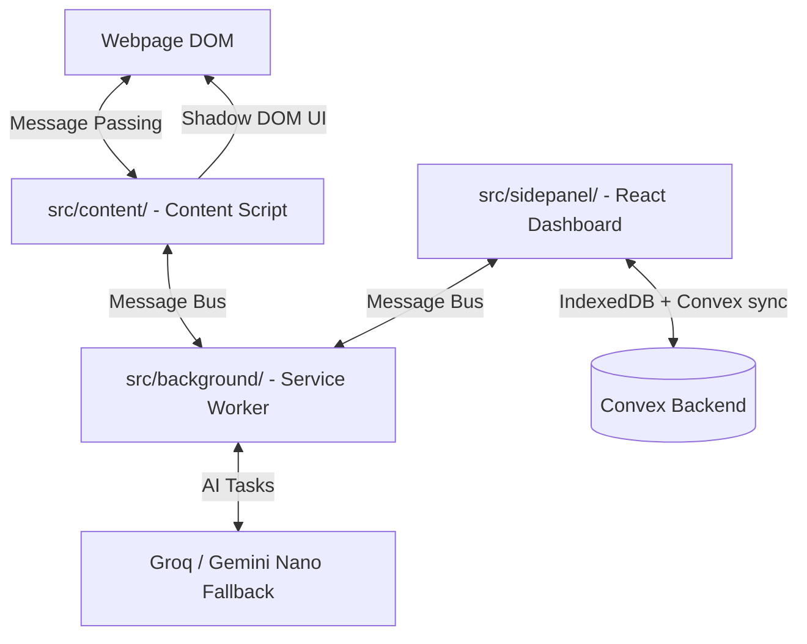

<p align="center">
  
</p>

<h1 align="center">Website Highlight Saver</h1>

<p align="center">
  <strong>A Chrome Extension to save, search, and AI-summarize text highlights from any webpage.</strong>
</p>

<p align="center">
  
  
  
  
  
</p>

---

## ✨ Features

| Feature | Description |
|---|---|
| 🖱️ **In-Page Tooltip** | Select any text — a floating tooltip appears with customizable actions: **Save Highlight**, **AI Summary**, and **Summarize Page** |
| ⚡ **Fast Streaming AI** | Real-time streaming AI responses powered by **Streamdown** Markdown rendering for summaries, rewrites, and flashcards with instant first-paint results |
| 🎯 **Context Cleaning** | Selection & keyword AI automatically strips webpage navigation chrome (e.g. Wikipedia headers) to focus purely on relevant content |
| 🎛️ **Personalization & Style Controls** | Train AI via a single **👍 Like** button and set custom **AI Tone & Style** preferences (e.g. concise, technical, academic) |
| 🎨 **Mist-and-Ink & Sky Theme UI** | Premium glassmorphism, mist-and-ink palette, and cloudy day/night theme with dynamic background animations and dark mode contrast |
| 🎛️ **Feature Toggles** | Customize extension behavior in popup/sidepanel settings — toggle on-page features (Keywords tile, Sticky notes) and tooltip action buttons |
| 📄 **Full Webpage Summarization** | Click "Summarize Page" to extract webpage content and generate structured sections: **Overview**, **Agenda & Main Topics**, and **Key Takeaways** |
| 🌓 **Light / Dark / System Theme** | Seamless theme switcher (Light/Dark/System) with live synchronization between popup dashboard, side panel, and in-page Shadow DOM tooltip |
| 🏷️ **Draggable Keyword Insights** | Automated keyword highlighting with a draggable, position-persisted keyword tile (`hs_tile_position`) and pastel sticky-note marks |
| 🌐 **Website Favicon Icons** | Displays original site favicons alongside saved highlights for easy visual website recognition |
| ✦ **In-Page AI Summary** | Click "AI Summary" in the tooltip to open an in-page Shadow DOM modal with formatted HTML Markdown rendering & accessible header close controls |
| ⚡ **SPA Navigation Handling** | Hardened SPA single-page application navigation detection and dynamic DOM re-injection |
| 🔐 **User Authentication** | Sign up / Sign in with email & password via Convex Auth — highlights are tied to your account |
| ☁️ **Cloud Storage & Sync** | Highlights and notes synced to Convex backend — persist across devices and browser sessions |
| 🔍 **Search & Filter** | Full-text search across all saved highlights, notes, and AI timeline history in the dashboard |
| 🗑️ **Delete Highlights & Notes** | Remove individual items from the dashboard with instant live UI updates |
| 🤖 **AI Summarization (Dashboard)** | Generate an AI summary of all your highlights (Groq-first multi-model AI with automatic failover) |
| 📋 **Copy to Clipboard** | Copy AI-generated summaries directly to clipboard with a single click |
| 📅 **Date & Time Stamps** | Highlights record and display localized 12-hour full date and time (e.g., `Jul 28, 2026, 6:59 PM`) |
| 📄 **Dashboard Pagination** | Highlights, notes, and AI timelines are paginated with 10 saved items per page, featuring `Prev`/`Next` controls |
| 🔑 **Change Password** | Secure password updates in settings using **Current Password Verification** |
| 🛡️ **Shadow DOM Isolation** | Tooltip, sticky notes, and AI dialog UI are fully isolated from host page CSS |


---

## 🏗️ Architecture

The extension follows the Chrome MV3 multi-process model rebuilt as a React single-page app (Side Panel) with a local-first IndexedDB layer, background AI routing, and Convex cloud sync:



### Context Isolation Model

| Context | Directory | Access |
|---|---|---|
| **Content Script** | `extension/src/content/` | Page DOM, Shadow DOM, message passing to background |
| **Side Panel** | `extension/src/sidepanel/` | React, IndexedDB, Convex Auth, mutations & queries |
| **Service Worker** | `extension/src/background/` | Multi-model AI routing, offline sync manager, cross-context messaging |
| **Convex Backend** | `convex/` | Database, Auth validation, server actions |

---

## 🛠️ Technology Stack

| Layer | Technology |
|---|---|
| Extension Format | Chrome Manifest V3 (Side Panel API) |
| Frontend | React, TypeScript, Vite, Tailwind CSS (Glassmorphism) |
| Storage | IndexedDB (local-first) + `chrome.storage.local` |
| Backend | [Convex](https://convex.dev) — serverless, real-time database |
| Auth | Convex Auth (email/password) |
| AI | [Groq](https://groq.com) primary, Gemini Nano on-device fallback |
| Typography | Inter + Outfit (Google Fonts) |

---

## 📁 Project Structure

```
website-highlight-saver/
├── extension/
│   ├── src/
│   │   ├── background/               # Service worker (AI routing, sync, message bus)
│   │   ├── content/                  # In-page tooltip, keyword tile, Shadow DOM modals
│   │   ├── sidepanel/                # React dashboard (highlights, notes, settings)
│   │   └── shared/                   # Messaging, IndexedDB, vectors, personalization
│   ├── dist/                         # Compiled MV3 extension output (Load unpacked this!)
│   ├── manifest.json                 # Chrome Extension MV3 config for Vite build
│   └── .env                          # API keys & Convex URL
│
├── convex/
│   ├── auth.ts                       # Convex Auth configuration
│   ├── highlights.ts                 # Highlight & Notes schemas/mutations
│   └── schema.ts                     # Database schema
│
└── root-level legacy wrappers        # Root config.js, icons generation
```

---

## 🚀 Getting Started

### Prerequisites

- Google Chrome (or any Chromium-based browser)
- Node.js ≥ 18
- A [Convex](https://dashboard.convex.dev) project
- (Developers only) An optional cloud AI API key for builds — **end users never paste a key**

### 1. Clone & Install

```bash
git clone <repo-url>
cd website-highlight-saver
npm install
```

### 2. Configure Environment

Copy `extension/.env.example` to `extension/.env` and update the Convex URL. Optionally, add a `VITE_GROQ_API_KEY` for developer-build AI functionality:

```env
VITE_CONVEX_HTTP_URL=https://your-deployment.convex.cloud
VITE_GROQ_API_KEY=
```

### 3. Deploy Convex Backend

```bash
npx convex dev
```

### 4. Build the Extension

```bash
npm run build
```

### 5. Load the Extension in Chrome

1. Open `chrome://extensions/`
2. Enable **Developer Mode** (top-right toggle)
3. Click **Load unpacked**
4. Select the **`extension/dist`** folder (do NOT select the repo root)
5. The **Website Highlight Saver** icon will appear in your Chrome toolbar ✅

---

## 💡 Usage

### Saving a Highlight
1. Navigate to any webpage
2. Select any text with your mouse / keyboard
3. A **"Save Highlight"** tooltip appears above the selection
4. Click it — if signed in, the highlight is saved to your local IndexedDB and Convex account instantly

### Side Panel Dashboard
1. Click the extension icon in the Chrome toolbar to open the **Side Panel**
2. **Sign in** or **Sign up** with your email & password
3. View all saved highlights and notes with infinite pagination (10/page)
4. **Search** across highlights in real-time using the search bar
5. **Delete** individual items with the trash icon
6. Click the 💡 **Summarize** button to generate an AI summary of all highlights

### AI Summaries & Flashcards
- Fast streaming multi-model AI (Groq primary, Gemini Nano fallback) with automatic failure recovery.
- No user API key or `chrome://flags` setup required.
- Context cleaning automatically strips Wikipedia/nav chrome and centers on your keyword.
- Personalize AI via **Accept / Reject** feedback on results.

---

## ⚙️ Key Engineering Notes

### 1. Shadow DOM — CSS Isolation

The in-page tooltip is rendered inside a Shadow DOM to prevent CSS conflicts with host page stylesheets. Without this, any page that does `* { color: red }` would break the tooltip's appearance.

```javascript
const container = document.createElement('div');
const shadow = container.attachShadow({ mode: 'open' });
// All tooltip styles & elements live inside `shadow` — host CSS cannot bleed in
```

### 2. Selection & Range API — Precise Tooltip Positioning

To float the tooltip exactly above selected text:

```javascript
const selection = window.getSelection();
const range = selection.getRangeAt(0);
const rect = range.getBoundingClientRect();

// Position tooltip above the selection with scroll offset
tooltipEl.style.top = `${rect.top + window.scrollY - tooltipHeight - 8}px`;
tooltipEl.style.left = `${rect.left + window.scrollX + rect.width / 2}px`;
```

### 3. Extension Context Invalidation

When you reload the extension during development (`chrome://extensions/` → Reload), active tabs keep the old content script running. Clicking "Save" in a stale tab throws `Extension context invalidated`. The defensive fix:

```javascript
function isContextValid() {
  try {
    return !!(typeof chrome !== 'undefined' && chrome.runtime && chrome.runtime.id);
  } catch (e) {
    return false;
  }
}
// If invalid → tooltip transforms into "Refresh Page to Save" button
// Clicking it calls window.location.reload() to inject fresh content script
```

### 4. Async Callback Error Handling

Chrome's storage/API callbacks execute outside the synchronous call stack — exceptions inside them are **invisible** to outer `try/catch`. Always nest error handling inside callbacks:

```javascript
// ❌ Wrong — outer catch will NOT catch errors inside the callback
try {
  chrome.storage.local.get({ highlights: [] }, (result) => {
    throw new Error(); // uncaught!
  });
} catch (err) { }

// ✅ Correct — wrap callback body in its own try/catch
chrome.storage.local.get({ highlights: [] }, (result) => {
  try {
    // safe async code
  } catch (callbackErr) {
    console.error('Storage callback error:', callbackErr);
  }
});
```

---

## 🔒 Permissions Explained

| Permission | Reason |
|---|---|
| `storage` | Save extension settings locally in the browser |
| `clipboardWrite` | Copy AI-generated summaries to clipboard |
| `https://api.groq.com/*` | Groq AI inference API |
| `https://*.convex.cloud/*` | Convex backend API & authentication |
| Content script on all URLs | Inject tooltip on every webpage the user visits |

---

## 🛠️ Development Scripts

| Command | Description |
|---|---|
| `npx convex dev` | Start Convex dev server + auto-deploy backend functions |
| `node generate_icons_from_logo.js` | Regenerate `icon16/48/128.png` from `icons/logo.png` using `sharp` |
| `npm install` | Install all dependencies (including `sharp` for icon generation) |

---

## 📄 File Reference

| File | Role |
|---|---|
| [`manifest.json`](manifest.json) | Extension MV3 config — permissions, icons, content scripts |
| [`content.js`](content.js) | In-page tooltip (**Save**, **AI Summary**, **Summarize Page**), keywords tile & sticky notes, Shadow DOM modal, SPA handling, theme & feature prefs sync |
| [`popup.html`](popup.html) | Popup layout — auth screen, mist-and-ink sky-themed dashboard, settings panel with feature toggles, AI summary overlay |
| [`popup.css`](popup.css) | Glassmorphism dark, sky, and mist-and-ink quiet theme styles, ambient backgrounds, card animations |
| [`popup.js`](popup.js) | Auth logic, CRUD operations, Groq AI API calls, search, theme switcher (Light/Dark/System), feature toggles sync (`hs_feature_prefs`) |
| [`config.js`](config.js) | Environment configuration for Convex deployment URL and Groq API key |
| [`generate_icons_from_logo.js`](generate_icons_from_logo.js) | Resizes `logo.png` into `icon16/48/128.png` via `sharp` |
| [`convex/auth.ts`](convex/auth.ts) | Convex Auth provider configuration |

---

<p align="center">Built with ❤️ using <strong>Convex</strong>, <strong>Groq</strong>, and <strong>Chrome MV3</strong></p>